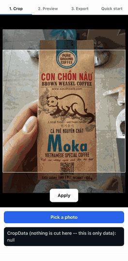

# react-native-image-crop-data

Non-destructive image cropping for React Native: store a crop as data, not as a re-encoded
file. Pinch-and-pan editing, resolution-independent replay, and physical pixel export are three
separate, composable steps.

<p align="center">
  
</p>

## Why not just another cropper

Most React Native cropping components cut the file the moment the user confirms a crop. That
works, but it throws information away:

| | Typical file-cropping component | react-native-image-crop-data |
|---|---|---|
| What gets produced | A new, re-encoded image file | A small JSON object (`CropData`) describing the crop |
| Editing the crop again | Requires re-cropping an already re-encoded file — each pass loses a little quality | Re-open the editor with the same `CropData`; nothing was thrown away |
| Showing the crop at a different size | Needs a new file per size, or re-cropping | The same `CropData` replays correctly at any preview size |
| The original file | Overwritten or discarded | Untouched, for as long as you want |
| Physically cutting pixels | Happens on every save | Happens once, only when you explicitly ask for it |

## How the model works

```
pick an image
  -> ImageCrop              (pinch + pan; produces a CropData)
  -> store CropData          (a few numbers, in your own database - the image file is untouched)
  -> ImageWithCrop            (replays CropData, at any size, as many times as you like)
  -> ImageCrop again           (re-opens the editor seeded with the same CropData, for editing)
  -> getCropRect() + your own image manipulator   (the one explicit, physical export step)
```

The crop stays data throughout this cycle. Only the last step touches pixels.

## Installation

```
npm install react-native-image-crop-data
```

Exactly four peer dependencies, none of them Expo:

| Package | Range |
|---|---|
| `react` | `>=19.0.0` |
| `react-native` | `*` — no floor declared by this library |
| `react-native-gesture-handler` | `>=2.0.0` |
| `react-native-reanimated` | `>=3.0.0` |

`react >= 19` is required by the API, not just tested against it: `ImageCrop` is generic over
the injected renderer's props *and* exposes an imperative `ref`. React 19 lets `ref` be declared
as an ordinary prop, so the generic type is still inferred correctly. Wrapping the component in
`forwardRef` (the pre-19 way to accept a ref) returns a non-generic type and silently collapses
that inference back down to the default renderer's props.

### Wrap your app in `GestureHandlerRootView`

Do this **before** anything else below — it needs to happen once, at the root of your app.
Illustrative only: unlike the snippets further down, this one is not lifted from the example
app — there is no separate "app root" file to lift it from — it is ordinary consumer-app
boilerplate.

```tsx
import { GestureHandlerRootView } from "react-native-gesture-handler";

export default function App() {
  return (
    <GestureHandlerRootView style={{ flex: 1 }}>
      {/* the rest of your app */}
    </GestureHandlerRootView>
  );
}
```

Without this wrapper, `react-native-gesture-handler`'s gestures silently never fire — no error,
no warning, the pinch/pan just does nothing. This is the single most common integration issue
for any library built on gesture-handler, and it is easy to miss because nothing points at it.

### Reanimated's Babel plugin

This library's own build never runs this plugin (see "Status" below for why) — it has to run in
*your* app's Babel config instead, because that's the only place the plugin version and the
installed Reanimated version are guaranteed to match:

- **Reanimated 3.x** — add `"react-native-reanimated/plugin"` to your `babel.config.js` plugins.
- **Reanimated 4.x** — worklets moved to a separate package; add `"react-native-worklets/plugin"`
  instead. Reanimated 4.x also requires the New Architecture.

Both of these follow Reanimated's own upstream guidance for their respective major version. Only
one of them is actually exercised by anything in this repository: the example app runs Reanimated
**4.1.1** with `"react-native-worklets/plugin"`, exactly as prescribed for 4.x — see "Status"
below for what that run does and doesn't cover. The 3.x variant is not exercised here.

## Quick start

```tsx
import { useState } from "react";
import type { ReactElement } from "react";
import { Text, View } from "react-native";
import type { CropData } from "react-native-image-crop-data";
import { ImageCrop } from "react-native-image-crop-data";

const SAMPLE_IMAGE_URI = "https://picsum.photos/id/1025/1600/1200";

export const QuickStartExample = (): ReactElement => {
  const [cropData, setCropData] = useState<CropData | null>(null);

  return (
    <View style={{ flex: 1 }}>
      <ImageCrop uri={SAMPLE_IMAGE_URI} aspectRatio={0.75} onCropApplied={setCropData} />
      <Text>{JSON.stringify(cropData)}</Text>
    </View>
  );
};
```

## API reference

### `ImageCrop`

Gesture-driven crop editor: pinch to zoom, pan to reposition, inside a fixed-aspect crop
window. Produces a `CropData`, not a cropped file.

| Prop | Type | Default | Notes |
|---|---|---|---|
| `uri` | `string` | — | Required. Measures the image and, by default, becomes the renderer's `source={{ uri }}`. URI strings only — see Caveats. |
| `ImageComponent` | `ComponentType<P>` | `Image` from `react-native` | The injected renderer. See "Renderer injection" below. |
| `imageProps` | `Omit<P, "style">` | — | Props forwarded to the renderer, fully typed for whichever `ImageComponent` was passed. |
| `aspectRatio` | `number` | `1` | Width / height. See "Aspect ratio convention". |
| `cropData` | `CropData` | — | Seeds the editor (e.g. to re-edit a saved crop). Not a controlled value — the component owns the live crop after the first gesture. |
| `imageSize` | `Size` | — | Skips the async `Image.getSize` measurement when already known. |
| `containerSize` | `Size` | — | Overrides the `onLayout` measurement. |
| `cropPadding` | `number` | `8` | Inset of the crop window from the container, applied on **each** side. |
| `maxScale` | `number` | `20` | Maximum zoom, as a multiplier of "the image exactly covers the crop window" — same unit as `CropData.scale`. Values below `1` are treated as `1`; covering the crop window always wins. |
| `backgroundColor` | `string` | `"#000000"` | Behind the image. |
| `overlayColor` | `string` | `"rgba(0, 0, 0, 0.4)"` | Passed to the built-in `CropOverlay`; ignored when `renderOverlay` is used. |
| `borderColor` | `string` | `"#FFFFFF"` | Passed to the built-in `CropOverlay`; ignored when `renderOverlay` is used. |
| `borderWidth` | `number` | `1` | Passed to the built-in `CropOverlay`; ignored when `renderOverlay` is used. |
| `renderOverlay` | `(rect: CropRect) => ReactNode` | built-in overlay | Full replacement for the crop-window overlay. |
| `renderFooter` | `(api: { apply: () => void; canApply: boolean }) => ReactNode` | built-in button | Full replacement for the bottom panel. Only rendered (built-in or custom) when `onCropApplied` is supplied. |
| `submitLabel` | `string` | `"Apply"` | Text of the built-in button. Localizing it is up to you. |
| `insets` | `{ bottom?: number }` | `{}` | Safe-area inset for the **built-in** button only. Does not affect crop geometry. |
| `onCropApplied` | `(cropData: CropData) => void` | — | Called on apply. Supplying this prop is what makes the built-in (or custom) footer render at all. |
| `onCropChange` | `(cropData: CropData) => void` | — | Called at the end of a pinch/pan gesture — never on every gesture frame. |
| `onImageSize` | `(size: Size) => void` | — | Called once the image's natural size is measured. Not called when `imageSize` is supplied directly. |
| `onError` | `(error: unknown) => void` | — | Called if measuring the image fails, instead of an unhandled rejection. |
| `style` | `StyleProp<ViewStyle>` | — | Root view style. Applied over the root's own `flex: 1`, so this is where you give the component a height when the parent does not (see Caveats). |
| `testID` | `string` | — | |
| `ref` | `Ref<ImageCropHandle>` | — | `getCropData()` and `reset()` — see below. |

`ImageCropHandle` (the `ref`'s shape):

| Method | Returns | Notes |
|---|---|---|
| `getCropData()` | `CropData \| null` | `null` until both the image and container size are known. Call it outside an active gesture — reading mid-gesture may lag what's on screen by a frame. |
| `reset()` | `void` | Back to the identity crop for the current `aspectRatio`. |

### `ImageWithCrop`

Non-destructive replay of a stored `CropData` — the exact framing a user saw in the editor,
without ever touching the source image.

| Prop | Type | Default | Notes |
|---|---|---|---|
| `uri` | `string` | — | Required. |
| `cropData` | `CropData` | — | Omit it and the image just fills the container at the renderer's own default fit — no measurement, no delay. |
| `ImageComponent` | `ComponentType<P>` | `Image` from `react-native` | The injected renderer. |
| `imageProps` | `Omit<P, "style">` | — | Merged over a default `source={{ uri }}`. See the `uri` / `imageProps.source` caveat below before overriding `source`. |
| `aspectRatio` | `number` | — | Applied to the container's style. Should always match the `aspectRatio` `cropData` was produced with — see Caveats. |
| `imageSize` | `Size` | — | Skips the async measurement. |
| `headers` | `Record<string, string>` | — | **Measurement only** (`Image.getSizeWithHeaders`). Headers for drawing go separately into `imageProps.source` — this component can't type-safely pull them out of an unknown renderer's `source` shape. |
| `animatedWidth` / `animatedHeight` | `SharedValue<number>` | — | Animated container size (e.g. inside a carousel). Both or neither. |
| `onError` | `(error: unknown) => void` | — | |
| `style` | `StyleProp<ViewStyle>` | — | |
| `testID` | `string` | — | |

### `CropOverlay`

The built-in crop-window overlay, exported so you can call it yourself from `renderOverlay`, or
reuse its geometry elsewhere.

| Prop | Type | Default | Notes |
|---|---|---|---|
| `rect` | `CropRect` | — | Required. Crop window, in the parent's coordinate space. |
| `overlayColor` | `string` | `"rgba(0, 0, 0, 0.4)"` | Colour of the four dimmed bands. |
| `borderColor` | `string` | `"#FFFFFF"` | |
| `borderWidth` | `number` | `1` | |

### Functions

| Function | Signature | Notes |
|---|---|---|
| `getCropRect` | `({ imageSize, aspectRatio, cropData, rounding? }) => CropRect` | `CropData` → pixel rectangle on the source image, whole-pixel and inside the image bounds by default — ready for any native manipulator. Pass `rounding: "none"` for the exact fractional rectangle. |
| `getDisplaySize` | `(imageSize, containerSize) => Size` | Contain-fit size of an image inside a container. A Reanimated worklet — safe to call from `useAnimatedStyle`. |
| `getCropWindowSize` | `(containerSize, aspectRatio, padding?) => Size` | Size of the crop window: the largest rectangle of `aspectRatio` that fits inside `containerSize` minus `padding` on each side. Never exceeds `containerSize`. |
| `getImageSize` | `(uri, options?: { headers? }) => Promise<Size>` | Wraps `Image.getSize` / `Image.getSizeWithHeaders`. Always rejects with an `Error` instance. |
| `clamp` | `(value, min, max) => number` | Restricts `value` to `[min, max]`. A Reanimated worklet. |

### Types

| Type | Shape | Notes |
|---|---|---|
| `Size` | `{ width: number; height: number }` | |
| `CropData` | `{ scale: number; translateX: number; translateY: number }` | See "CropData explained". |
| `CropRect` | `{ x: number; y: number; width: number; height: number }` | Pixels, in the source image's own coordinate space. |
| `CropImageBaseProps` | `{ style?: StyleProp<ImageStyle> }` | The entire constraint an `ImageComponent` must satisfy — see "Renderer injection". |
| `IDENTITY_CROP` | `CropData` constant, `{ scale: 1, translateX: 0, translateY: 0 }` | The neutral crop: centred, no zoom beyond covering the window. |

### Renderer injection

Both components accept an `ImageComponent` and render whatever you pass — `Image` from
`react-native` (the default), `expo-image`'s `Image`, or a component of your own. The type
constraint is deliberately narrow: an `ImageComponent` only has to accept `style`, because
geometry is the one thing this library must own exclusively. Everything else the renderer needs
— `source`, headers, caching, placeholders, a fit mode — goes through `imageProps`, typed as
exactly what the renderer you passed accepts (minus `style`).

Neither component ever sets a fit mode (`resizeMode` / `contentFit`): they compute the image's
contain-fit display size and render it at exactly that size, where every fit mode agrees. Pass
one through `imageProps` if you like — it won't do anything, but it won't break anything either.

## CropData explained

`CropData` is not a pixel rectangle. It's a normalised description of how an image is
positioned and zoomed relative to a crop window:

- **`scale`** — zoom, relative to "the image exactly covers the crop window". `1` is the
  minimum: the image can never be zoomed out past the point it stops covering the window.
- **`translateX`** — horizontal offset of the image's centre from the window's centre, as a
  fraction of the window's **width**. `0` is centred.
- **`translateY`** — the same, vertically, as a fraction of the window's **height**.

All three numbers are unit-less ratios — not pixels, not tied to any particular screen. That's
what makes `CropData` reconstructible into an exact pixel rectangle from nothing but the source
image's own size and the crop's `aspectRatio` — no container size, no display size, no device
involved. Store it as plain JSON; replay it on any device, at any preview size, and it lands in
exactly the same place.

**The one hard rule:** a `CropData` is only valid for the `aspectRatio` it was created with.
Replaying it against a *different* aspect ratio — e.g. showing a 1:1 crop inside a 16:9
container — produces a wrong, misaligned picture, silently. Always pass the same `aspectRatio`
to `ImageWithCrop` that was used to produce the `CropData` you're replaying.

## Status

**Verified on a device:**

- The example app has been run on a physical Android device (New Architecture, Reanimated
  4.1.1): pinch/pan gesture feel and panning bounds at the edges of the crop window, re-editing
  a saved crop, replay across preview sizes and aspect ratios, physical export via
  `expo-image-manipulator` visually matching its `ImageWithCrop` preview, and overlay seam
  rendering.
- What that run does **not** cover — iOS and EXIF-rotated camera photos — is listed under
  "Known gaps" below.

**Verified by automated checks:**

- Type checking, including a dedicated renderer-contract test suite with negative cases (does
  the constraint actually reject a foreign prop, a `style` override, an incompatible renderer? —
  checked by removing each expected-error marker and confirming the build then breaks).
- Unit tests of the pure maths core, close to 100% coverage.
- Build output: ESM + CommonJS + type declarations; `publint` and `@arethetypeswrong/cli` both
  clean, with no suppressed rules.
- Artifact composition checked against the real packed tarball — not just the source tree — for
  file listing, dependency leakage, and provenance hygiene.
- The `"worklet"` directive survives the published build end-to-end: confirmed by inspecting a
  real bundled consumer app's output, not just the library's own compiled files.
- Consumers resolve the built `lib/` output through standard `main` / `module` / `exports`
  fields. There is no legacy field forwarding to source — what `publint` and `attw` validate is
  exactly what a consumer runs.
- Only Reanimated **4.1.1** has actually been built, bundled, or run by anything in this
  repository. The peer range is declared as `>=3.0.0` because the APIs this library uses
  (`useSharedValue`, `useAnimatedStyle`, `Animated.View`, worklets) are identical across 3.x and
  4.x, but the 3.x branch of that range has not itself been run.

**Known gaps:**

1. **EXIF orientation is not specifically verified.** Camera photos routinely carry an EXIF
   rotation flag. `Image.getSize` reports the image's dimensions *without* applying that
   rotation, while the renderer that actually draws the image *does* apply it — so the two can
   disagree, and the crop is then computed against the wrong geometry. The device run above did
   not specifically exercise EXIF-rotated camera captures. If you crop photos straight from a
   camera, verify this on your target devices before relying on it; passing a known-correct
   `imageSize` prop bypasses the `Image.getSize` measurement path entirely and sidesteps the
   discrepancy.
2. **No iOS run.** The device run above was Android-only; nothing in this repository has been
   executed on an iOS device or simulator.

## Recipes

Recipes marked **Verified** are lifted mechanically into this README, by the same script that
generated it, from the example app's real source — not retyped: type-checked, bundled, and
executed as part of the example app's run on a real Android device (see "Status" above).
Recipes marked **Unverified** are a reasonable starting point, but nothing in this repository has
ever executed them.

### Export via `expo-image-manipulator`

**Verified — lifted from the example app's real source and executed on a real Android device (the example's Export screen runs exactly this function).**

```ts
import { ImageManipulator } from "expo-image-manipulator";
import type { CropData } from "react-native-image-crop-data";
import { getCropRect, getImageSize } from "react-native-image-crop-data";

/**
 * Physically crops `uri` down to `cropData`'s framing, via `expo-image-manipulator`.
 *
 * Measures the source itself. Pass `imageSize` instead when the caller already knows it (an
 * image picker result carries it, for one) — the measurement is a round trip worth skipping.
 */
export const exportCroppedImage = async (
  uri: string,
  aspectRatio: number,
  cropData: CropData,
): Promise<string> => {
  const imageSize = await getImageSize(uri);
  const { x, y, width, height } = getCropRect({ imageSize, aspectRatio, cropData });

  const image = await ImageManipulator.manipulate(uri)
    .crop({ originX: x, originY: y, width, height })
    .renderAsync();
  const { uri: croppedUri } = await image.saveAsync();

  return croppedUri;
};
```

### Export via `@react-native-community/image-editor`

**Unverified.** `@react-native-community/image-editor` is not installed anywhere in this
repository, and this snippet has never been executed — treat it as a starting point, not a
tested recipe.

```ts
import ImageEditor from "@react-native-community/image-editor";
import { getCropRect } from "react-native-image-crop-data";
import type { CropData, Size } from "react-native-image-crop-data";

export async function exportWithImageEditor(
  uri: string,
  imageSize: Size,
  aspectRatio: number,
  cropData: CropData,
): Promise<string> {
  const { x, y, width, height } = getCropRect({ imageSize, aspectRatio, cropData });

  const { uri: croppedUri } = await ImageEditor.cropImage(uri, {
    offset: { x, y },
    size: { width, height },
  });
  return croppedUri;
}
```

### Render via `expo-image`

**Verified — lifted from the example app's real source and executed on a real Android device (the example's Preview screen renders exactly this component).**

```tsx
import type { ReactElement } from "react";
import { Image as ExpoImage } from "expo-image";
import type { CropData } from "react-native-image-crop-data";
import { ImageWithCrop } from "react-native-image-crop-data";

interface Props {
  uri: string;
  cropData: CropData;
  aspectRatio: number;
}

export const ExpoImageRendererExample = ({ uri, cropData, aspectRatio }: Props): ReactElement => (
  <ImageWithCrop
    uri={uri}
    cropData={cropData}
    aspectRatio={aspectRatio}
    style={{ width: "100%", aspectRatio }}
    ImageComponent={ExpoImage}
    imageProps={{
      cachePolicy: "memory-disk",
      placeholder: { blurhash: "L6PZfSi_.AyE_3t7t7R**0o#DgR4" },
      // Required with this library, not a preference: the crop is applied as a transform scale,
      // so the image is drawn larger than the view expo-image decodes for. Downscaling is on by
      // default, which leaves an enlarged crop visibly soft.
      allowDownscaling: false,
    }}
  />
);
```

### Server-side crop with `sharp`

**Unverified.** This library has no server-side test harness, and `sharp` is not a dependency
anywhere in this repository — this snippet has never been run.

```ts
import sharp from "sharp";
import { getCropRect } from "react-native-image-crop-data";
import type { CropData, Size } from "react-native-image-crop-data";

export async function exportWithSharp(
  inputPath: string,
  outputPath: string,
  imageSize: Size,
  aspectRatio: number,
  cropData: CropData,
): Promise<void> {
  const { x: left, y: top, width, height } = getCropRect({ imageSize, aspectRatio, cropData });

  await sharp(inputPath).extract({ left, top, width, height }).toFile(outputPath);
}
```

## Aspect ratio convention

`aspectRatio` is always **width / height**, matching CSS `aspect-ratio` and React Native's own
`aspectRatio` style:

| `aspectRatio` | Meaning |
|---|---|
| `1` | Square |
| `0.75` | 3:4 portrait |
| `1.7778` | 16:9 |

**Migrating from a height/width convention?** If your existing values mean height divided by
width (a common convention — e.g. a portrait ratio expressed as `4/3`), convert with
`1 / oldRatio`: `4/3` becomes `0.75`, `16/9` becomes `0.5625`. The two conventions produce
numbers that look similar in the same value range, so a mismatched conversion doesn't crash — it
silently produces a crop with the wrong orientation. Convert every stored ratio once, at the
boundary, rather than mixing conventions.

## Caveats

- **`ImageCrop` fills its parent, so the parent has to give it a height.** Its root view is
  `flex: 1` and it measures itself through `onLayout`; nesting depth does not matter, but a
  parent that leaves the height undefined does. Inside a `ScrollView`'s content container, for
  example, `flex: 1` resolves to zero: the component measures `0` and renders nothing at all —
  no warning, no error, just an empty area. Give it a size through `style` when the parent
  cannot:

  ```tsx
  <ImageCrop uri={uri} aspectRatio={1} style={{ height: 420 }} />
  ```

  `style` is applied over the root's own `flex: 1`, so `height` or `aspectRatio` there win. Use
  `containerSize` instead to bypass measurement entirely.
- **Do not scale or rotate an ancestor of `ImageCrop` with `transform`.** `onLayout` reports
  layout size, not visual size, so a transformed ancestor leaves the component measuring one
  thing while the user sees another: the crop window is computed for the untransformed box, and
  the recorded `CropData` silently disagrees with what was on screen. Animating the ancestor's
  width/height (or passing `animatedWidth`/`animatedHeight`) is fine — those go through layout.
- **Only `uri` strings are accepted — not `require()` assets.** Both components (and
  `getImageSize`) measure the image via `Image.getSize`, which does not accept bundled asset
  references.
- **`ImageCrop` has no `headers` prop.** Unlike `ImageWithCrop`, it measures the image with a
  plain `Image.getSize(uri)` call and no options, so it cannot measure an image that requires
  authentication. For a protected `uri`, pass the `imageSize` prop directly and skip the
  measurement entirely.
- **The container's aspect ratio must match the crop's.** `ImageWithCrop` has no way to detect a
  mismatch on its own — pass `aspectRatio` and keep it in sync with whatever `aspectRatio` the
  `cropData` was produced with, or the picture is silently wrong.
- **A renderer that doesn't accept `style` compiles, but the crop silently never applies.**
  TypeScript's structural typing can't reject this: a component that simply *omits* an optional
  `style` prop satisfies `{ style?: ... }` just as well as one that honours it. If you write a
  custom `ImageComponent`, make sure it actually forwards `style` to something that lays out and
  paints — the type system will not catch it if it doesn't.
- **`getCropRect` returns whole pixels inside the image bounds — hand it straight to a
  manipulator.** Rounding happens before the final clamp, because rounding up would otherwise
  push a coordinate one pixel past the edge; sides are never rounded down to zero. The
  trade-off is that whole-pixel sides cannot hold an exact `aspectRatio`, so the returned ratio
  may be off by up to a pixel. Pass `rounding: "none"` when you need the exact fractional
  rectangle — then rounding, and re-clamping after it, are yours to handle.
- **If you override `imageProps.source`, its `uri` must match the `uri` prop.** `uri` is what
  gets measured; `imageProps.source` is what actually gets drawn. If they name different images,
  the crop geometry is computed for one image while a different one is shown — with no error,
  just a crop that looks wrong.
- **`react-native-gesture-handler` 3.x marks the builder API this library uses (`Gesture.Pan()`
  / `Gesture.Pinch()`) as deprecated** (see gesture-handler's PR #4103). As of gesture-handler
  3.1.0 this is a JSDoc-only deprecation — the code compiles and runs correctly — but your
  editor may show it struck through, and a lint rule that flags `@deprecated` symbols will warn.
  A migration to the hook-based API is planned for a future release; it is not required for this
  library to work today.
- See "Status" above for what has, and hasn't, been verified on a real device.

## Contributing

Issues and pull requests are welcome.

## License

MIT — see `LICENSE`.
